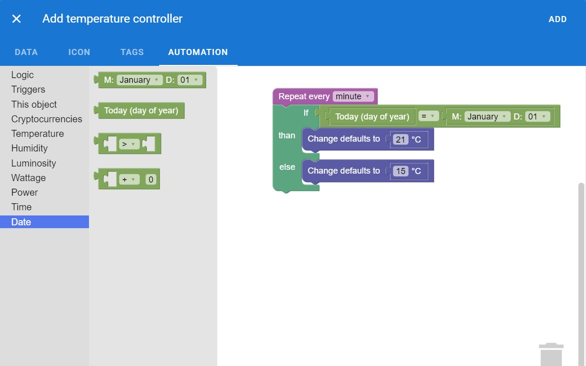

# Google Blockly integration

The *Blockly* library adds an editor to your objects that represents coding concepts as interlocking blocks. It outputs syntactically correct automation script that is understood by Automate Everything. You can read more about Blockly [here](https://developers.google.com/blockly).

All blocks are strongly typed! This prevents failures because you're not able to add watts to celsius or other things. The developers can also create custom blocks that are reused across other plugins!
