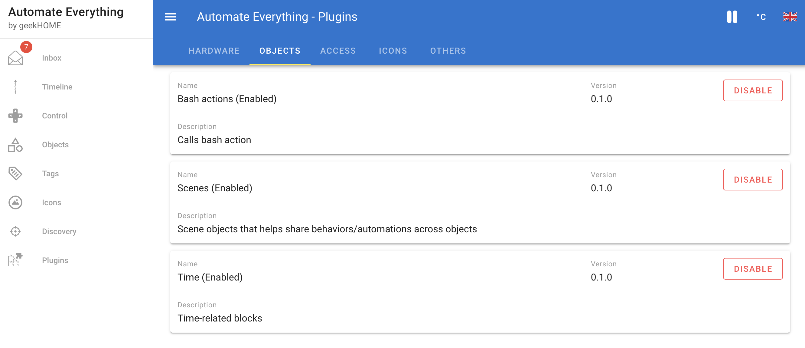
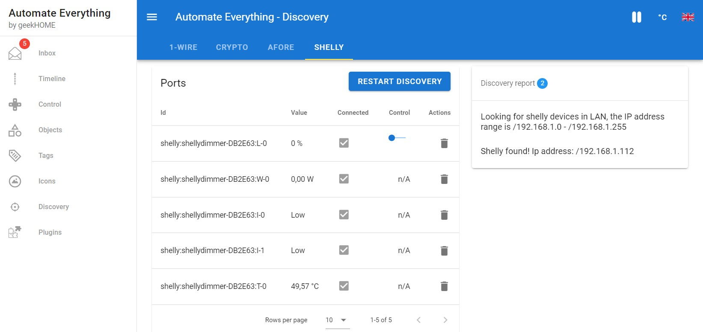

# Everything is a plugin
The plugins are a core feature of Automate Everything. Almost everything in the system can be extended. The plugins can define new objects, act as a hardware drivers for new devices, define actions or custom automation blocks.

If you are a developer you MUST SEE the developer documentation of [plugins](../dev/Plugins.md)!

## The list of plugins
By selecting different set of plugins, Automate Everything can perform different automation tasks: from a full-blown home automation, through automated sprinkler controller to a crypto-trading bot!

Every plugin can have its dedicated settings. You don't need to change the scripts or play with external editors... everything can be configured in the GUI:

## Every object is a plugin
Every object is a plugin:

Every object can be configured in the GUI:

## Every Automation block is a plugin
Developers can define custom automation blocks to extend the system even further:

## Plugins are looking for compatible hardware
No more scripting and configuration hassle! Hardware plugins can discover devices in the Cloud, your local LAN network or the ones connected to the system (like USB).
The plugin can also post messages to the "discovery report board" and inform the user about the progress or obstacles. 

## Plugins can post messages to the Inbox
Even the inbox can be filled with the posts coming from the plugins:

## It's just the beginning
It's not the end. The list of plugins and the type of plugins will grow every day as Automate Everything will grow and attract other developers.