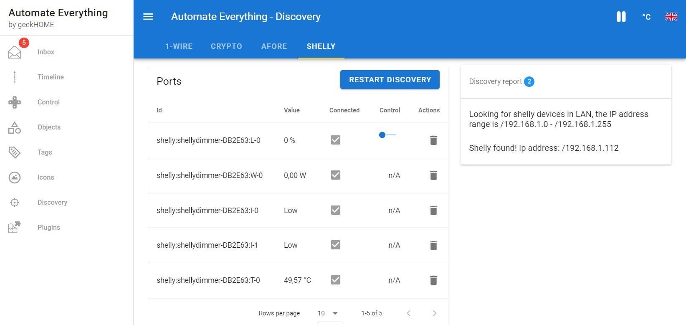
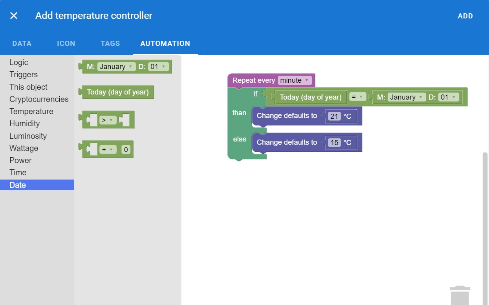
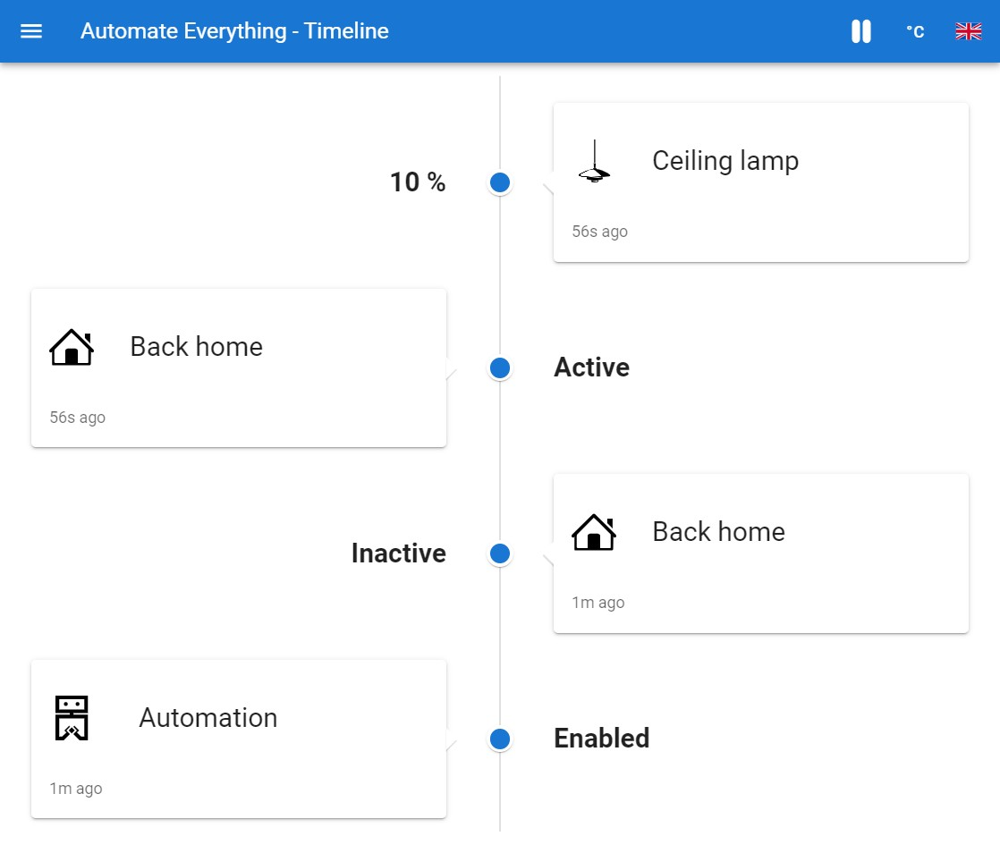

# Modern UI

Automate Everything is using [Vuetify](https://vuetifyjs.com/en) which is a [Vue](vue.js) UI Library with beautifully handcrafted Material Components.
Setting up the automations is simple as dragging and dropping thanks to [Blockly](https://developers.google.com/blockly).

See the example screenshots:

//TODO: add control screen
